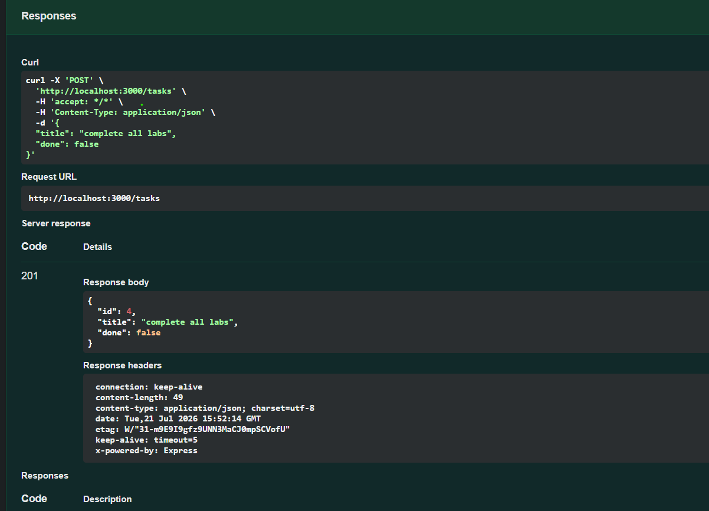

# Todo API

A simple REST API for managing tasks using Node.js and Express.

## Installation & Run

```bash
npm install
node app.js
```

## API Endpoints

| Method | Endpoint     | Description              |
| ------ | ------------ | ------------------------ |
| GET    | `/tasks`     | Get all tasks            |
| GET    | `/tasks/:id` | Get a task by ID         |
| POST   | `/tasks`     | Create a task            |
| PUT    | `/tasks/:id` | Update a task            |
| DELETE | `/tasks/:id` | Delete a task            |
| GET    | `/docs`      | Swagger UI documentation |

## Example `curl -i`

```bash
curl -i http://localhost:3000/tasks
```

Example output:

```http
HTTP/1.1 200 OK
Content-Type: application/json

[]
```

## Swagger UI


